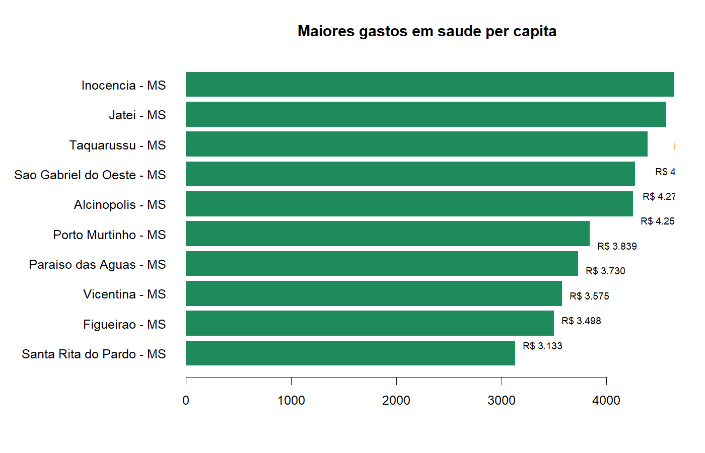
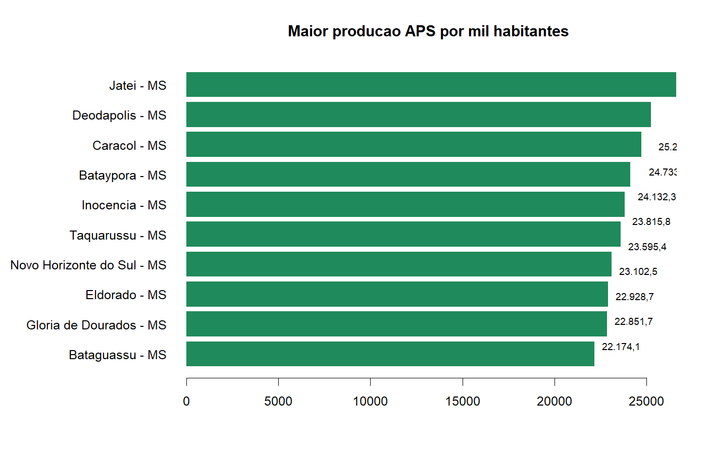

# Rede, Financiamento e Produção SUS | Mato Grosso do Sul

**Análise municipal da capacidade instalada, financiamento e produção assistencial do SUS**


---

## Dashboard interativo

**[Abrir dashboard online](https://matheusassiso.github.io/saude-rede-financiamento-producao-sus/)**

Painel interativo com mapa limitado aos 79 municípios de Mato Grosso do Sul, seleção de indicadores, perfis municipais, resumo executivo, análise exploratória e links para dados, Rmd e PDF.


---

## Objetivo

Este projeto integra cinco dimensões de análise pública em saúde:

1. rede assistencial;
2. financiamento municipal;
3. atenção primária;
4. produção ambulatorial;
5. perfis municipais integrados.

A pergunta central é:

> **Como estrutura assistencial, financiamento e produção do SUS se distribuem entre os municípios de Mato Grosso do Sul, e quais perfis territoriais aparecem quando essas dimensões são analisadas em conjunto?**

---

## Motivação

Bases como CNES, SIOPS, SISAB e SIA/SUS geralmente são analisadas separadamente. Essa separação dificulta uma leitura profissional de gestão e análise de dados: um município pode ter maior gasto per capita por escala populacional, maior produção ambulatorial por exercer papel regional, ou mais estrutura física proporcional sem ser grande em população.

O projeto consolida essas fontes em uma leitura municipal única, com foco em:

- evidência descritiva;
- análise exploratória;
- comparação territorial;
- mapas coropléticos;
- comunicação dos resultados por dashboard.

---

## Dados

| Dimensão | Fonte analítica | Indicadores usados |
|---|---|---|
| Rede assistencial | CNES | estabelecimentos, leitos SUS, equipamentos, vínculo SUS |
| Financiamento | SIOPS | gasto per capita, composição do gasto, transferências e recursos próprios |
| Atenção primária | SISAB | produção municipal de APS em 2025 |
| Produção ambulatorial | SIA/SUS | quantidade aprovada, valor aprovado e valor per capita |
| Perfil integrado | base municipal consolidada | clusters, componentes principais e indicadores territoriais |

Abrangência: **79 municípios de Mato Grosso do Sul**.

---

## Método

Pipeline analítico:

```text
Bases públicas → padronização municipal → indicadores per capita
→ análise descritiva → rankings exploratórios
→ perfis municipais → mapas → dashboard
```

Etapas principais:

1. padronização dos códigos municipais;
2. consolidação das bases por município;
3. cálculo de taxas por habitante e por 10 mil habitantes;
4. estatística descritiva dos indicadores estaduais;
5. rankings exploratórios de gasto, produção e estrutura;
6. classificação dos municípios em perfis integrados;
7. análise geoespacial com mapas coropléticos;
8. publicação dos resultados em RMarkdown, PDF e dashboard.

---

## Resultados descritivos

| Indicador | Resultado |
|---|---:|
| Municípios analisados | 79 |
| População coberta | 2.901.895 |
| Estabelecimentos CNES | 6.529 |
| Leitos SUS | 4.618 |
| Equipamentos registrados | 42.143 |
| Produção ambulatorial aprovada | 55.366.170 |
| Valor ambulatorial aprovado | R$ 367.450.965 |
| Produção APS SISAB 2025 | 36.102.693 |
| Gasto em saúde per capita mediano | R$ 2.258 |
| Leitos SUS por 10 mil habitantes, mediana | 13 |

---

## Perfis municipais

| Perfil | Municípios | Leitura sintética |
|---|---:|---|
| Cluster 1 | 9 | municípios pequenos com alta capacidade local |
| Cluster 2 | 6 | maior gasto e perfil de alerta em desfechos |
| Cluster 3 | 31 | polos regionais e rede mais densa |
| Cluster 4 | 33 | menor densidade estrutural |

Os perfis não são ranking de qualidade. Eles funcionam como uma síntese exploratória para comparar estrutura, gasto e produção em municípios com papéis diferentes na rede SUS.

---

## Mapas e evidências visuais

### Perfis municipais integrados


### Gasto em saúde per capita


### Leitos SUS por 10 mil habitantes


### Valor ambulatorial aprovado per capita


### Rankings exploratórios





---

## Relatório

- [Relatório PDF](rede_financiamento_producao_sus.pdf)
- [Relatório RMarkdown](rede_financiamento_producao_sus.Rmd)
- [Relatório HTML](docs/relatorio.html)
- [Dashboard interativo online](https://matheusassiso.github.io/saude-rede-financiamento-producao-sus/)
- [Arquivo HTML do dashboard](docs/rede_sus_dashboard.html)

O PDF foi gerado por:

```r
rmarkdown::render(
  "rede_financiamento_producao_sus.Rmd",
  output_format = "pdf_document"
)
```

---

## Estrutura do repositório

```text
.
├── R/
│   └── code.R
├── scripts/
│   └── build_project.R
├── data/
│   ├── municipios_rede_sus.csv
│   ├── perfis_municipais.csv
│   ├── resumo_indicadores.csv
│   └── ms_rede_sus.geojson
├── figures/
│   ├── 01_mapa_perfis_municipais.png
│   ├── 02_mapa_gasto_per_capita.png
│   ├── 03_mapa_leitos_sus.png
│   ├── 04_mapa_producao_ambulatorial.png
│   ├── 05_ranking_gasto_per_capita.png
│   └── 06_ranking_aps.png
├── docs/
│   ├── index.html
│   ├── data/
│   ├── figures/
│   ├── rede_sus_dashboard.html
│   └── relatorio.html
├── rede_financiamento_producao_sus.Rmd
├── rede_financiamento_producao_sus.pdf
├── rede-sus.Rproj
└── COMMIT_INSTRUCTIONS.txt
```

---

## Como reproduzir

Abra `rede-sus.Rproj` no RStudio e execute:

```r
source("scripts/build_project.R")
```

O script reconstrói as figuras, o dashboard, o relatório HTML e o PDF.

---

## Limitações

A análise é exploratória. Indicadores administrativos podem sofrer atraso, revisão e diferenças de cobertura entre municípios. Indicadores per capita podem destacar municípios pequenos. Mapas, clusters e rankings ajudam a formular hipóteses e priorizar investigação, mas não substituem validação institucional, auditoria documental ou avaliação causal de políticas públicas.

---

## Contato

**Matheus Assis de Oliveira**

[](https://github.com/matheusassiso)
