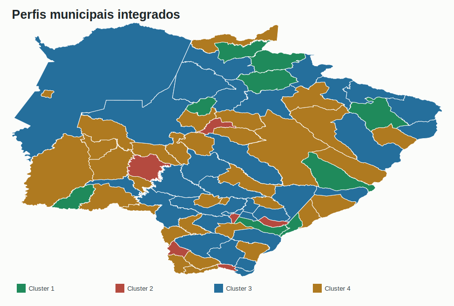
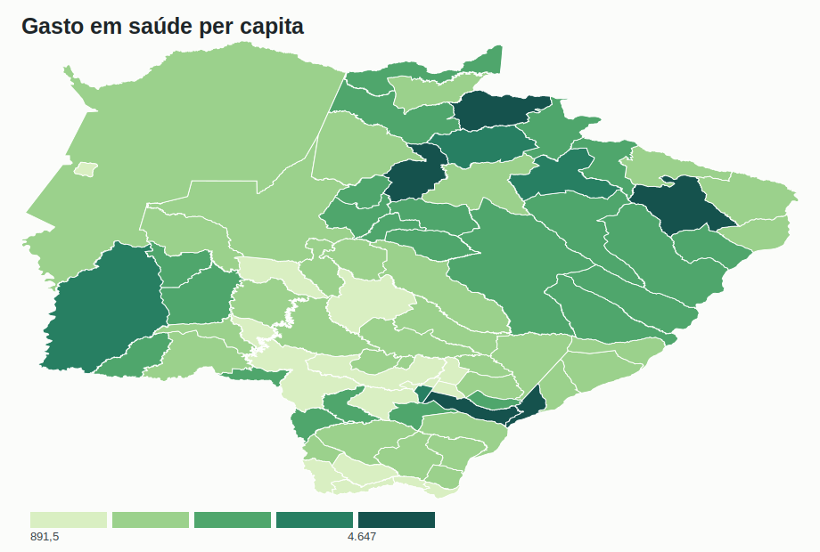
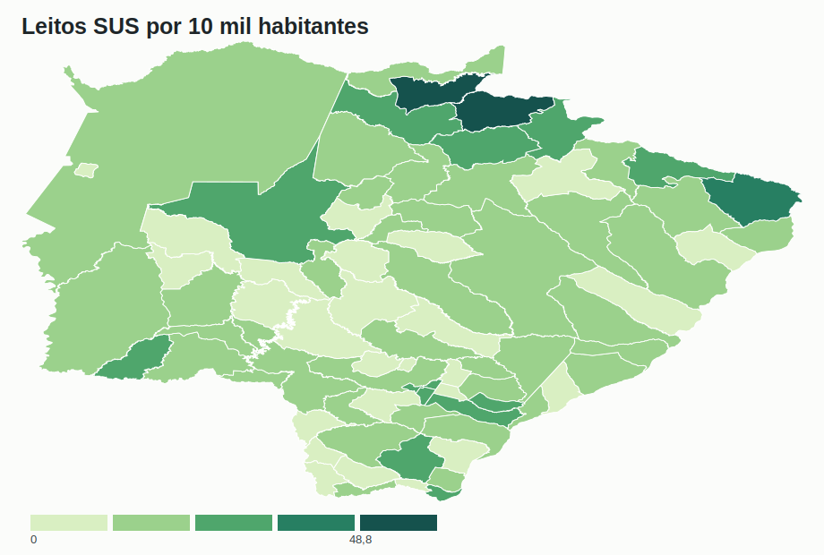
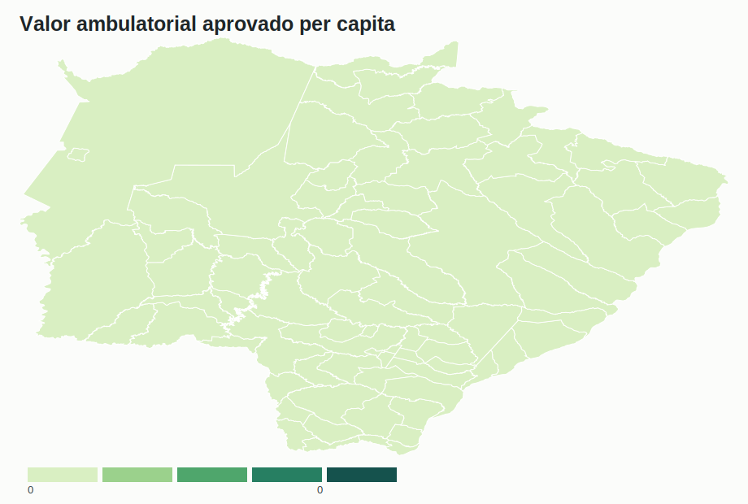

# Rede, Financiamento e Produção SUS · Mato Grosso do Sul

[](docs/rede_sus_dashboard.html)
[](rede_financiamento_producao_sus.pdf)

Este repositório apresenta um projeto único de análise aplicada sobre rede assistencial, financiamento municipal e produção do SUS em Mato Grosso do Sul. A proposta não é empilhar estudos isolados, mas organizar cinco dimensões analíticas em uma sequência única: estrutura da rede, orçamento, atenção primária, produção ambulatorial e perfis municipais integrados.

---

## Motivação

Bases públicas de saúde costumam ser consultadas separadamente. CNES mostra capacidade instalada; SIOPS mostra financiamento; SISAB e SIA/SUS mostram produção; a análise de agrupamentos mostra perfis municipais. Separadas, essas bases explicam pouco. Integradas, elas permitem uma leitura profissional sobre oferta, gasto, escala, dependência territorial e prioridades de investigação.

---

## Pergunta de análise

**Como estrutura assistencial, financiamento e produção do SUS se distribuem entre os municípios de Mato Grosso do Sul, e quais perfis territoriais aparecem quando essas dimensões são analisadas em conjunto?**

---

## Dados e métodos

| Dimensão | Fonte analítica | Papel no estudo |
|---|---|---|
| Rede assistencial | CNES | Estabelecimentos, leitos SUS, equipamentos e vínculo SUS |
| Financiamento | SIOPS | Gasto per capita, composição do gasto e aplicação de recursos próprios |
| Atenção primária | SISAB | Produção municipal de APS em 2025 |
| Produção ambulatorial | SIA/SUS | Quantidade e valor aprovado em 2024 |
| Perfil integrado | Matriz municipal consolidada | Agrupamentos exploratórios e análise geoespacial |

O fluxo analítico segue a ordem: padronização municipal, consolidação das fontes, indicadores per capita, análise descritiva, análise exploratória, agrupamento municipal e mapas coropléticos.

---

## Resultados descritivos

| Indicador | Resultado |
| --- | --- |
| Municípios analisados | 79 |
| População coberta | 2.901.895 |
| Estabelecimentos CNES | 6.529 |
| Leitos SUS | 4.618 |
| Equipamentos registrados | 42.143 |
| Produção ambulatorial aprovada | 55.366.170 |
| Valor ambulatorial aprovado | R$ 367.450.965 |
| Produção APS SISAB 2025 | 36.102.693 |
| Gasto em saúde per capita mediano | R$ 2.258 |
| Leitos SUS por 10 mil habitantes (mediana) | 13 |

---

## Perfis municipais

| Perfil | Municípios | Gasto per capita | Leitos SUS/10 mil | Síntese |
| --- | --- | --- | --- | --- |
| Cluster 1 | 9 | R$ 3.498 | 24,3 | Small municipalities with high local capacity |
| Cluster 2 | 6 | R$ 2.465 | 9,5 | High spending and outcome-alert profile |
| Cluster 3 | 31 | R$ 2.007 | 15,1 | Regional hubs and dense network |
| Cluster 4 | 33 | R$ 2.153 | 9,3 | Lower-density structure |

---

## Mostras visuais









---

## Dashboard interativo

> [**Abrir dashboard**](docs/rede_sus_dashboard.html) — mapa municipal com seleção de indicadores, resumo executivo e links para dados finais.

---

## Estrutura

```
saude-rede-financiamento-producao-sus/
├── R/code.R                                → funções auxiliares da análise
├── scripts/build_project.mjs               → reconstrói dados, figuras, Rmd, dashboard e PDF
├── data/                                   → bases finais consolidadas
├── figures/                                → mapas e rankings do estudo
├── docs/rede_sus_dashboard.html            → dashboard interativo
├── rede_financiamento_producao_sus.Rmd     → relatório-fonte
├── rede_financiamento_producao_sus.pdf     → relatório final
└── README.md
```

---

## Como reproduzir

```bash
node scripts/build_project.mjs
pandoc rede_financiamento_producao_sus.Rmd --standalone --toc -o docs/relatorio.html
```

A renderização do PDF foi feita a partir do HTML com Microsoft Edge em modo headless.

---

## Limitações

A análise é exploratória. Os indicadores administrativos podem sofrer atraso, revisão e diferenças de cobertura. Mapas e rankings ajudam a formular hipóteses e priorizar investigação, mas não substituem validação institucional, auditoria documental ou avaliação de política pública.
