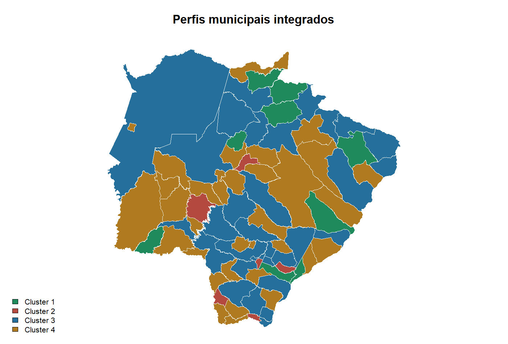
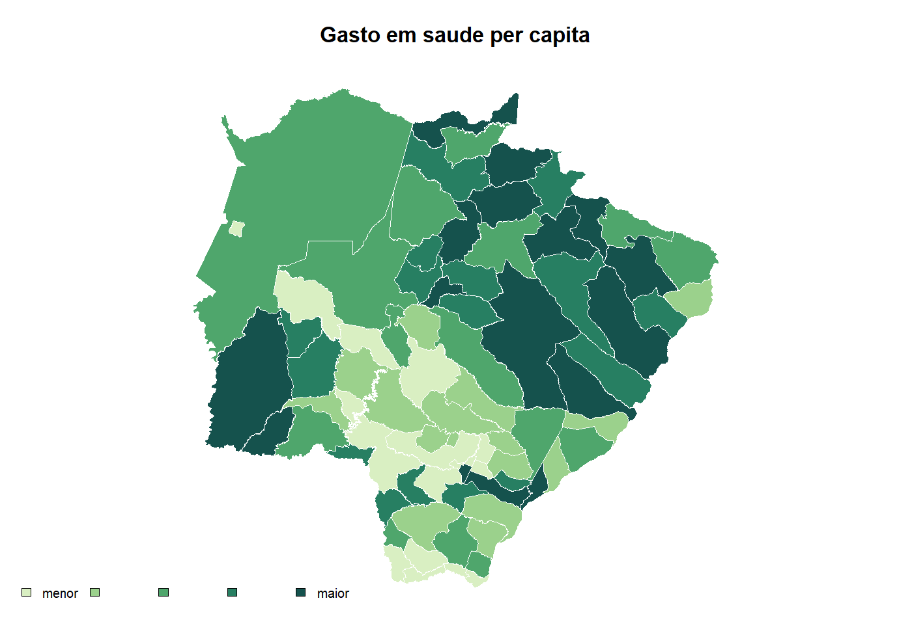
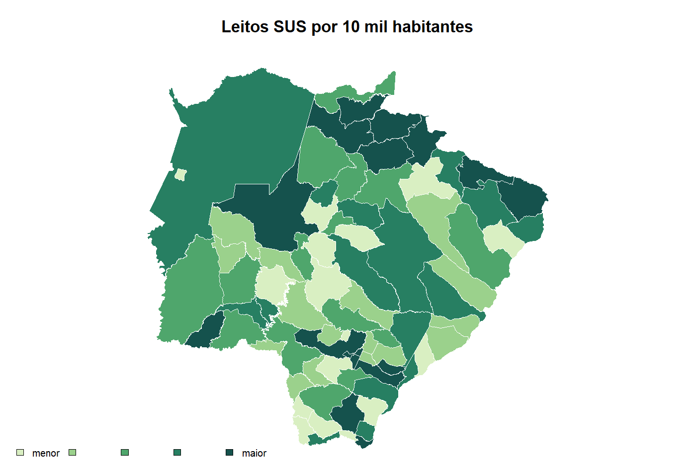
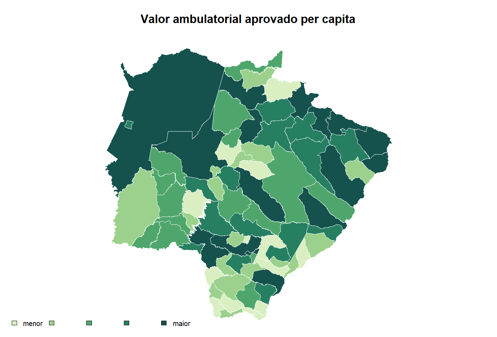

```{r setup, include=FALSE}
knitr::opts_chunk$set(
  echo = FALSE,
  message = FALSE,
  warning = FALSE,
  fig.width = 10,
  fig.height = 6.5,
  dpi = 150,
  out.width = "100%"
)

source("R/code.R")
municipios <- read_project_csv("data/municipios_rede_sus.csv")
resumo <- read_project_csv("data/resumo_indicadores.csv")
perfis <- read_project_csv("data/perfis_municipais.csv")
```

# Introdução

Este repositório é um **projeto R único** de análise aplicada sobre rede assistencial, financiamento municipal e produção do SUS em Mato Grosso do Sul. A proposta é organizar cinco dimensões analíticas em uma sequência única: estrutura da rede, orçamento, atenção primária, produção ambulatorial e perfis municipais integrados.

A pergunta central é: **como estrutura assistencial, financiamento e produção do SUS se distribuem entre os municípios, e quais perfis territoriais aparecem quando essas dimensões são analisadas em conjunto?**

# Motivação

A análise isolada de bases públicas cria uma leitura fragmentada. CNES mostra capacidade instalada; SIOPS mostra financiamento; SISAB e SIA/SUS mostram produção; a análise de agrupamentos mostra perfis territoriais. Integrar essas dimensões torna a leitura mais útil para um perfil profissional de analista de dados: menos relatório solto, mais fluxo analítico reproduzível.

# Dados

```{r dados}
knitr::kable(resumo, col.names = c("Indicador", "Resultado"))
```

Foram consolidados os seguintes blocos:

- **Rede assistencial**: estabelecimentos, leitos SUS, equipamentos e vínculo SUS.
- **Financiamento**: gasto per capita, composição do gasto e aplicação de recursos próprios.
- **Atenção primária**: produção municipal registrada no SISAB.
- **Produção ambulatorial**: quantidade e valor aprovado no SIA/SUS.
- **Perfil integrado**: agrupamento municipal por estrutura, gasto e indicadores de contexto.

# Métodos

O projeto segue um fluxo simples:

1. consolidação das bases finais por município;
2. padronização de códigos municipais;
3. cálculo de indicadores por habitante e por 10 mil habitantes;
4. análise descritiva estadual;
5. rankings exploratórios;
6. análise de perfis municipais;
7. mapas coropléticos;
8. dashboard interativo.

# Resultados descritivos

```{r resultados-descritivos}
summary_cols <- c(
  "population_2024",
  "facilities",
  "sus_beds",
  "existing_equipment",
  "health_spending_per_capita",
  "outpatient_value_per_capita_brl",
  "primary_care_production_per_1000"
)

estatisticas <- data.frame(
  indicador = summary_cols,
  media = sapply(municipios[summary_cols], mean, na.rm = TRUE),
  mediana = sapply(municipios[summary_cols], median, na.rm = TRUE),
  minimo = sapply(municipios[summary_cols], min, na.rm = TRUE),
  maximo = sapply(municipios[summary_cols], max, na.rm = TRUE)
)

knitr::kable(estatisticas, digits = 2)
```

# Análise exploratória

## Perfis municipais integrados

```{r perfis}
knitr::kable(perfis)
```

Os agrupamentos organizam os municípios em perfis úteis para leitura profissional: municípios pequenos com capacidade local elevada, perfis de maior gasto e alerta, polos regionais de rede mais densa e municípios com menor densidade estrutural.

## Rankings

```{r rankings}
ranking_gasto <- top_n(municipios, "health_spending_per_capita", 8)[, c("municipality_name", "health_spending_per_capita", "cluster_label")]
ranking_amb <- top_n(municipios, "outpatient_value_per_capita_brl", 8)[, c("municipality_name", "outpatient_value_per_capita_brl", "outpatient_approved_quantity")]
ranking_aps <- top_n(municipios, "primary_care_production_per_1000", 8)[, c("municipality_name", "primary_care_production_per_1000", "primary_care_total_production_2025")]

knitr::kable(ranking_gasto, digits = 2, caption = "Maiores gastos em saúde per capita")
knitr::kable(ranking_amb, digits = 2, caption = "Maiores valores ambulatoriais per capita")
knitr::kable(ranking_aps, digits = 2, caption = "Maiores produções de APS por mil habitantes")
```

# Análise geoespacial

A análise geoespacial mostra a distribuição territorial dos indicadores. Ela é exploratória: mapas ajudam a localizar padrões, contrastes e hipóteses de investigação, mas não explicam causalidade sozinhos.









# Dashboard interativo

O dashboard em `docs/rede_sus_dashboard.html` facilita a leitura por município, indicador e perfil. Ele foi pensado para avaliação profissional rápida: mapa, indicadores executivos, ranking e acesso às bases finais.

# Resultados gerados

- `data/municipios_rede_sus.csv`
- `data/resumo_indicadores.csv`
- `data/perfis_municipais.csv`
- `figures/*.png`
- `docs/rede_sus_dashboard.html`
- `docs/relatorio.html`
- `rede_financiamento_producao_sus.pdf`

# Limitações

Os dados são administrativos e podem ter atraso, revisão e diferenças de cobertura. Indicadores per capita podem supervalorizar municípios pequenos. Mapas e clusters apontam padrões, mas não explicam causalidade. A leitura final precisa considerar escala populacional, papel regional dos serviços e validação institucional.
